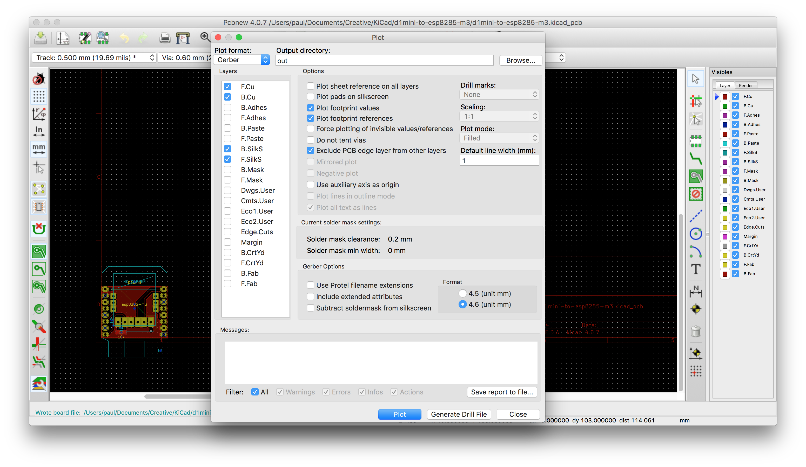

# Kicad2gcode

This is a tool to generate gcode for a CNC 1610 from [KiCad](http://kicad-pcb.org) projects with the following assumptions:

You have
- a bash shell to execute this script `kicad2gcode.sh`
- a working installation of [FlatCAM](http://flatcam.org)
- your KiCad projects in one directory, for example:
    - ~/kicad/project1/
    - ~/kicad/project2/
    - ~/kicad/...
- configured `kicad-env-config.sh`, see `kicad-env-config.sh.example`
- plotted and generated a gcode file from KiCad

Then you can run

```
./kicad2gcode.sh project1 default
```

so you will obtain a gcode file named `all.gen.gcode` within seconds, which you can send to your CNC.

## Limits
- ⚠️ I added a slowstart script that slowly turns on the spindle. Directly going to 100% blows the fuse on the powersupply that was delivered with my CNC. ⚠️
- Milling is done with a 0.1mm V-shape drill bit
- Holes are drilled to -1.6mm, all with the same drill bit (TODO?)
- Cutout is done in a single pass at -1.6mm, non rectangular cutout supported

## Details

### Kicad Env Config

The `kicad-env-config.sh` is used to provide the path to FlatCAM and the base directory of your KiCad projets.

*Note:* only absolute paths work.

Create it from `kicad-env-config.sh`.

### Creating intermediate Gerber files

I have Kicad configured to use **millimeters** and use the **A4** layout in the *PcbNew* view:


As I was not creative enough to figure out the offset of the pcb automatically, I figured the best solution would be to move the board into the bottom left corner and remove the offset (12,198) from within the `flatcam.shell` script.


The you need to generate (plot) the gerber files and dill files into the directory `out`:




Now you can run the `kicad2gcode.sh` script:


This will open `FlatCAM`, close it after the gcode has been generated (the console responds with `"Saved to:"`):


Then you can open the resulting `all.gen.gcode` with your favorite gcode sender, in my case [Candle](https://github.com/Denvi/Candle):


